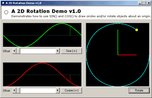



## A 2D Rotation Demo using SIN\(\) and COS\(\)

### Description

This VB code graphically shows the relationship between Sine and Cosine when drawing a cirlce. In my humble opinion, I think drawing a circle is the first thing all graphics programmers need to learn. Although it may look like I'm just plotting a single dot in a cirlce, there is another way of looking at this. You could say I am rotating the dot around it's origin. This is exactly the sort of code you will need to rotate a space ship around it's origin, ala 'Asteroids' style. In all my years of programming, I've never once seen an application such as this one. Hopefully, it will clear up what SIN and COS actually look like when plotted.
 
### More Info
 

             |
---                |---
**Submitted On**   |2004-02-04 11:05:42
**By**             |[Peter Wilson](https://github.com/Planet-Source-Code/PSCIndex/blob/master/ByAuthor/peter-wilson.md)
**Level**          |Beginner
**User Rating**    |4.9 (69 globes from 14 users)
**Compatibility**  |VB 6\.0
**Category**       |[Graphics](https://github.com/Planet-Source-Code/PSCIndex/blob/master/ByCategory/graphics__1-46.md)
**World**          |[Visual Basic](https://github.com/Planet-Source-Code/PSCIndex/blob/master/ByWorld/visual-basic.md)
**Archive File**   |[A\_2D\_Rotat170394242004\.zip](https://github.com/Planet-Source-Code/peter-wilson-a-2d-rotation-demo-using-sin-and-cos__1-51487/archive/master.zip)

